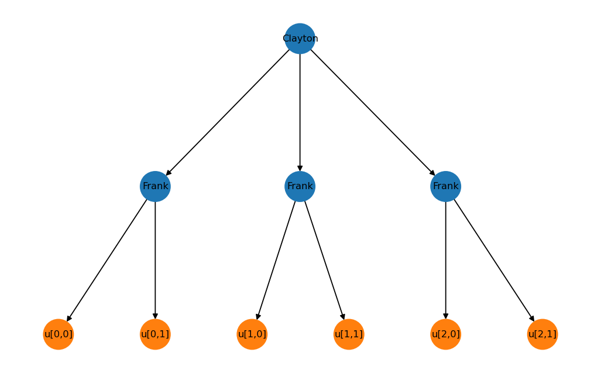
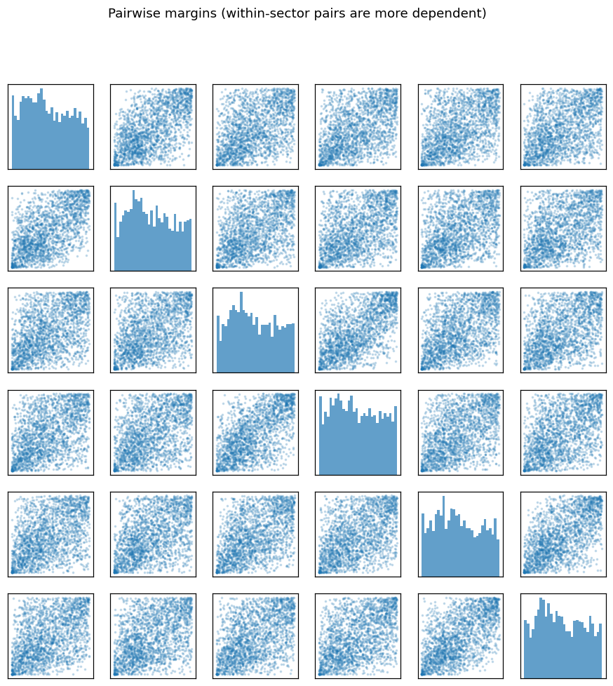

# Examples

The [`examples/`](https://github.com/thisiscam/acopula/tree/main/examples)
directory has runnable, self-contained scripts. Each uses small synthetic /
copula-scale data — no external datasets required.

Run them from the repo root:

```bash
uv run python examples/01_quickstart.py
uv run python examples/02_fit_mle.py
uv run python examples/03_censored_survival.py
uv run --extra examples python examples/04_sampling_and_visualize.py [output_dir]
```

## 01 — Quickstart

Build a two-level nested copula, evaluate the log-likelihood and its exact
`jax.grad`. See [Quickstart](quickstart.md).

## 02 — Maximum-likelihood fitting

Simulate 1000 observations from a known `d=10` Clayton copula (two sectors of
five), then recover the parameters by gradient-descent MLE with `optax`. The
whole likelihood is differentiable, so the fit is plain
`jax.value_and_grad` + Adam:

```
parameter         true     fitted
  theta_root      2.00      1.958
  theta_sector    5.00      4.840
```

## 03 — Censored survival

A bivariate Frank copula over two Weibull event times, where the second is
right-censored. A censored leaf still enters the copula argument (through its
survival function) but is not differentiated in the density — `acopula`
assembles the correct mixed partial over only the observed dimensions.

## 04 — Sampling and visualization

Draw samples from a Clayton-over-Frank copula (one root, three sectors of two
leaves) with the Marshall-Olkin sampler, and render the copula tree.

### Copula tree

`CompiledModel.visualize()` draws the structural graph — root and sector
copulas in blue, leaves in orange:



### Sampled margins

Pairwise scatter of the six sampled margins. Within-sector pairs
(`u[i,0]`–`u[i,1]`) are visibly more dependent than across-sector pairs,
reflecting the nesting:


